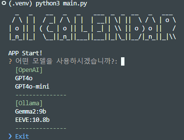
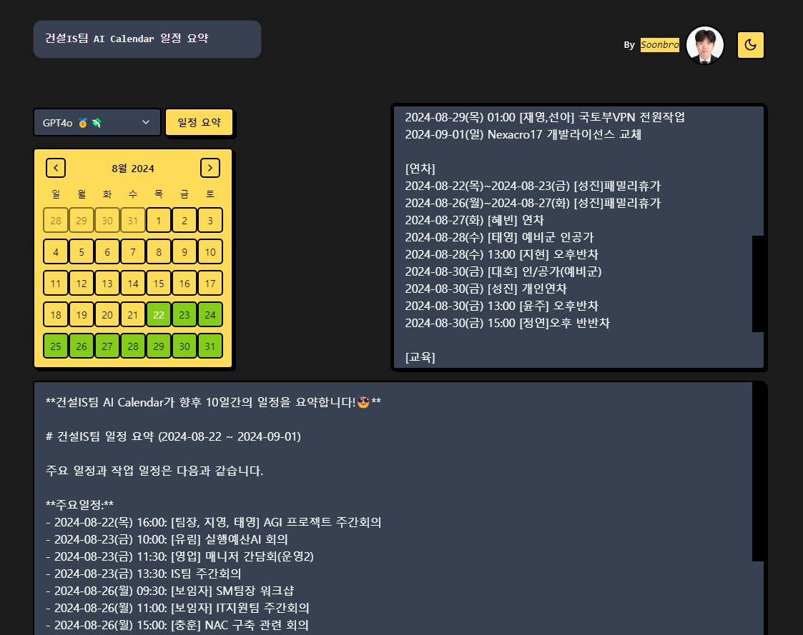

# LOTTE E&C IS TEAM AI CALENDAR

롯데건설 IS팀 AI 캘린더 - by. Soonbro


> ## 🚧🏗️THIS PROJECT IS STILL WORK IN PROGRESS (WIP)🏗️🚧
>
> 🚧🚧🚧🚧🚧🚧🚧🚧🚧🚧🚧🚧🚧🚧🚧🚧🚧🚧🚧🚧🚧🚧🚧🚧
>
> ⚠️ 아직 개발 중인 프로젝트입니다.
>
> - 2024-08-01 - Add Model Select CLI and ADD Ollama models
> - 2024-08-20 - Add Web Frontend

## 기능 목록

- [x] 구글 캘린더 연동
- [x] OpenAI, Ollama LLM 모델 지원
- [x] CLI 기반 일정 요약 (Complete)
- [ ] 일정 요약 및 추가 질문 답변 (Chat)
- [x] API Backend Server (FastAPI)
- [x] UI Frontend APP (Next.js)
- [ ] Desktop App

## CLI



### Command (Post Install)

```bash
$ cd backend
$ . .venv/bin/activate
$ python3 main.py
```

## Web


### Command (Post Install)

```bash
$ cd frontend
$ pnpm dev
```

# 사용법 (How To Use)

## Install (Backend)

### Clone Repository

```bash
git clone https://github.com/soonbro/isteam-ai-calendar.git
```

### Python 가상환경 세팅

```bash
$ cd backend
$ python -m venv .venv
```

Windows

```bash
. .venv/Scripts/activate
```

Linux or Mac

```bash
. .venv/bin/activate
```

### Python 패키지 설치

```bash
$ (.venv) pip install -r requirements.txt
```

### 환경변수 세팅 (set ENV)

- CAL_ID_XXXX : Google Calendar ID 세팅
- OPENAI_API_KEY : OpenAI API Key
- OLLAMA_HOST (Option) : Ollama Host Server Address (default: localhost)

```bash
$ cd backend
$ cp .env.example .env
$ vi .env
```

### Google Calendar API

구글 캘린더 API를 사용하기 위해 Google Cloud API 및 서비스 설정  
사용자 인증정보 생성 후 `credentials.json` 파일을 받아 프로젝트 루트 경로에 위치.  
(Set Google Calendar API and OAuth. `credentials.json` File to Project root folder.)

### CLI 실행

```
$ python main.py
or
$ python3 main.py
```

---

## Install (Frontend)

package manager : pnpm

### 패키지 의존성 설치 (Install Package Dependencies)

```
$ cd frontend
$ pnpm i
```

### 개발 서버 실행 (Run Dev Server)

```
$ pnpm dev
```

http://localhost:3000/



---

# 개발 참고

## 프로젝트 세팅

### 프로젝트 폴더 생성

```bash
mkdir isteam-ai-calendar
cd isteam-ai-calendar
```

**VSCode 실행**  
`code .`

### python 가상환경 생성

```bash
python -m venv .venv
ls -a
```

`./  ../  .venv/`

### (선택) .gitingnore 파일 생성

```bash
echo '.venv' >> .gitignore
cat .gitignore
```

`.venv`

### 가상환경 activate

Windows

```bash
. .venv/Scripts/activate
```

Linux or Mac

```bash
. .venv/bin/activate
```

`(.venv)`

### 가상환경 activate 확인

```bash
which python
```

```bash
/c/Users/Soonbro/Dev/AI/isteam-ai-calendar/\Users\Soonbro\Dev\AI\isteam-ai-calendar\.venv/Scripts/python
(.venv)
```

### 구글 캘린더 API 관련 패키지 설치

```bash
pip install --upgrade google-api-python-client google-auth-httplib2 google-auth-oauthlib
```

### 토큰 생성 스크립트

_API 사용을 위해 Google Cloud 설정 필요_
https://console.cloud.google.com/apis/credentials

`API 및 서비스 > 사용자 인증 정보`

`+ 사용자 인증 정보 만들기`

OAuth 2.0 클라이언트 ID 생성 및 json 파일 download

`credentials.json` 파일 project root로 이동

> `credentials.json` 파일로 OAuth 인증 및 토큰 저장 샘플
> [calendar_quickstart github link](https://github.com/googleworkspace/python-samples/blob/master/calendar/quickstart/quickstart.py)

https://developers.google.com/calendar/api/quickstart/python?hl=ko

### AI 관련 패키지 설치

```bash
pip install openai langchain langchain-community langchain-openai
```

### 환경변수 세팅

- Google Calendar ID 세팅
- OpenAI API Key
- _(Option)_ Ollama Host Server Address (default: localhost)

---
